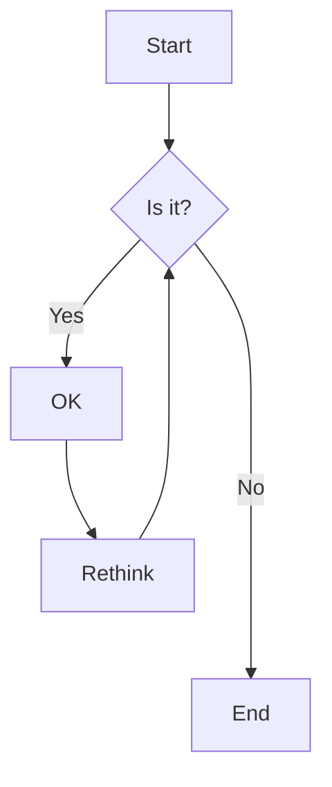
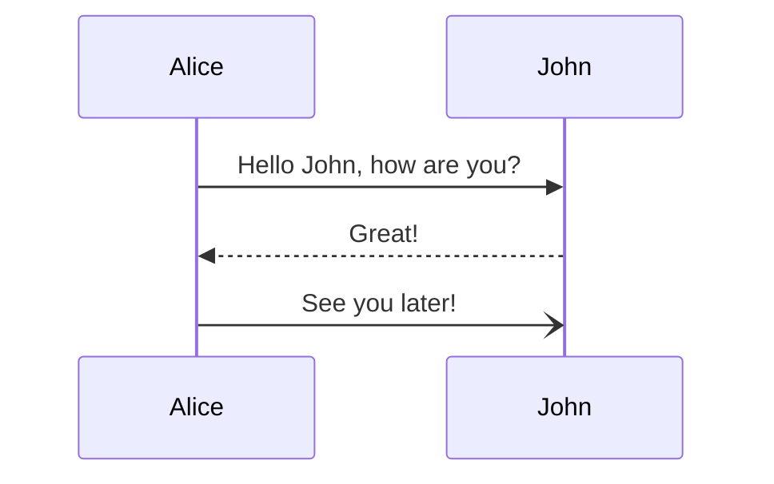

<style>
  :root {
    /* Typography */
    --base-font-family: system-ui,sans-serif;
    --base-line-height: 1.4;
    --base-font-size: 20px;

    /* Content */
    --content-max-width: 800px;

    /* Headings */
    --heading-color : #0891b2;
    --heading-h1-font-weight: 700;
    --heading-h2-font-weight: 700;

    /* Theme */
    --theme-color: #9333ea;

    /* Links */
    --link-color: var(--theme-color) !important;
    --link-color--hover: var(--theme-color) !important;

    /* Sidebar */
    --sidebar-name-color: var(--theme-color) !important;
    --sidebar-nav-link-color--active: var(--theme-color) !important;
    --sidebar-nav-link-border-color--active: var(--theme-color) !important;
  }

  .sidebar { 
    font-size: 18px;
  }
</style>

# Theme CSS Variable Demo

Explore the wide range of Markdown features available for creating various types of content.

## Headings
### H3 Heading
#### H4 Heading
##### H5 Heading
###### H6 Heading

## Text Formatting
Some **bold text** and *italic text* and ~~strikethrough text~~.

You can also use `inline code` within sentences.

## Links
### Standard Links
[External link](https://docsify.js.org)  
[Link with title](https://docsify.js.org "Docsify Documentation")  

### Anchor Links
[Jump to Summary](#summary)  
[Go to Code Blocks](#code-blocks)  

### Auto-linked URLs
https://docsify.js.org  
<https://github.com>  

## Lists
### Unordered List
* bullet
* items
  * nested item
  * another nested item

### Ordered List
1. Numbered list
1. Of items
   1. Sub-item
   1. Another sub-item

### Task List
- [x] Completed task
- [ ] Incomplete task
- [ ] Another task to do

## Tables
| Feature | Supported | Notes |
|---------|-----------|-------|
| Headers | ✅ | All heading levels |
| Lists | ✅ | Ordered, unordered, nested |
| Code | ✅ | Inline and blocks |
| Tables | ✅ | With alignment |

## Quote
> Quoted text
> 
> Multi-line quotes are also supported
> with proper formatting.

## Code Blocks
### JavaScript
```javascript
function hello(name) {
    return `Hello, ${name}!`;
}
```

### Python
```python
def fibonacci(n):
    if n <= 1:
        return n
    return fibonacci(n-1) + fibonacci(n-2)
```

## Images


## Horizontal Rule
Content above the line.

---

Content below the line.

## Emoji Support
Status: :white_check_mark: :x: :warning: | Feedback: :thumbsup: :heart: :fire: | Objects: :bulb: :key: :rocket:

## Alerts/Callouts (GitHub-flavored)
> [!NOTE]
> Highlights information that users should take into account.

> [!TIP]
> Optional information to help a user be more successful.

> [!WARNING]
> Critical content demanding user attention due to potential risks.

## Mermaid Diagrams
### Flow Chart


### Sequence Diagram Example


More information about **mermaid** syntax [here](https://mermaid-js.github.io/mermaid/).

## LaTeX Mathematical Expressions
Inline: $ax^2 + bx + c = 0$ and block:
$$
x = \frac{-b \pm \sqrt{b^2-4ac}}{2a}
$$

More information about **LaTeX** mathematical expressions [here](https://meta.math.stackexchange.com/questions/5020/mathjax-basic-tutorial-and-quick-reference).

## Keyboard Shortcuts
Press <kbd>Ctrl</kbd> + <kbd>C</kbd> to copy.

## Definition Lists
Term 1
: Definition of term 1

Term 2
: Definition of term 2
: Another definition for term 2

## Footnotes
Here's a sentence with a footnote[^1].

[^1]: This is the footnote text.

## HTML & Special Elements
Press <kbd>Ctrl</kbd> + <kbd>C</kbd> to copy.

Escape literal \*asterisks\* with backslashes.

<details>
<summary>Click to expand</summary>
This content is hidden by default and can be toggled.
</details>

### Embedded Video
<iframe width="560" height="315" src="https://www.youtube.com/embed/HUBNt18RFbo" title="Markdown Explained" frameborder="0" allow="accelerometer; autoplay; clipboard-write; encrypted-media; gyroscope; picture-in-picture" allowfullscreen></iframe>  

---

## Summary
This demo showcases the various Markdown features, including:
- Text formatting and structural elements
- Comprehensive linking capabilities
- Lists and organized content presentation
- Tables and quoted content
- Code syntax highlighting
- Images and visual separators
- Emoji support for enhanced communication
- GitHub-flavored alerts and callouts
- Interactive diagrams with Mermaid
- Mathematical expressions with LaTeX
- Special HTML elements and formatting
